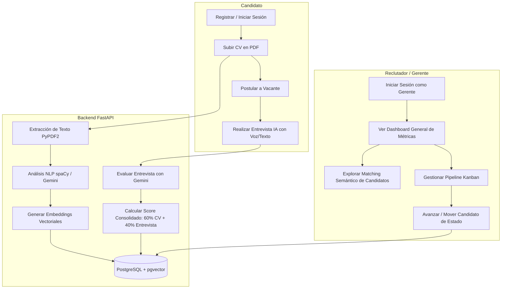

# 🚀 Korely - Plataforma de Reclutamiento Inteligente con IA

<div align="center">
  
  
  
  
  
  
</div>

---

## 📝 Descripción del Proyecto

**Korely** es una plataforma de adquisición de talento y reclutamiento inteligente diseñada para optimizar los procesos de contratación. Mediante el uso de inteligencia artificial generativa (**Google Gemini API**) y procesamiento de lenguaje natural (**spaCy**), la plataforma automatiza y mejora la evaluación de candidatos a través de un enfoque basado en datos.

### Características Clave
* 📄 **Digitalización y Perfilamiento de CV**: Ingesta de currículums en formato PDF con extracción automática de habilidades técnicas y trayectoria laboral por spaCy y Gemini.
* 🎙️ **Simulador de Entrevista por Voz/Texto**: Un entrevistador virtual autónomo que conversa con el candidato usando reconocimiento y síntesis de voz, evaluando conocimientos técnicos y aptitudes.
* 🧠 **Algoritmo de Matching Semántico**: Motor de búsqueda y ordenamiento de candidatos en base a la similitud vectorial (**pgvector** en PostgreSQL) y análisis de compatibilidad (60% ponderación de currículum + 40% desempeño en la entrevista).
* 🗂️ **Pipeline Kanban Interactivo**: Tablero visual para que los reclutadores gestionen el estado de los postulantes de forma ágil.
* 🔒 **Seguridad y Roles**: Vistas adaptativas según el rol del usuario (Reclutador/Gerente vs. Postulante/Candidato) con autenticación basada en JSON Web Tokens (JWT).

---

## 📐 Arquitectura y Flujo del Sistema

El siguiente diagrama muestra el flujo interactivo de los candidatos y reclutadores dentro del ecosistema de **Korely**:



---

## 📂 Estructura del Repositorio

El proyecto está organizado en las siguientes carpetas:

```text
Producto/
├── backend/                       # Backend en Python (FastAPI)
│   ├── database.py                # Conexión a la base de datos
│   ├── main.py                    # Rutas y lógica principal de la API
│   ├── models.py                  # Modelos relacionales de SQLAlchemy
│   ├── nlp_engine.py              # Integración con Gemini y spaCy
│   └── security.py                # Encriptación y seguridad con JWT
├── Frontend/                      # Frontend en Next.js (TypeScript)
│   ├── app/                       # Estructura de páginas de Next.js
│   ├── components/                # Componentes interactivos de React (Kanban, Matching, Interview)
│   └── services/                  # Capa de servicios y comunicación API
├── base_de_datos/                 # Scripts SQL y esquemas iniciales
├── docker-compose.yml             # Contenedor local de PostgreSQL con pgvector
├── manual_de_instalacion.md       # Guía de instalación y ejecución local
├── manual_de_implementacion_de_ambiente.md # Guía para implementar en producción (Railway)
├── manual_de_usuario.md           # Guía completa de uso de la plataforma
└── estado_casos_de_uso.md         # Reporte de avance y evidencias de casos de uso
```

---

## 🚀 Guías de Configuración y Despliegue

Disponemos de manuales completos para configurar la aplicación en diferentes entornos:

1. 💻 **Entorno de Desarrollo Local**: 
   Consulta el [Manual de Instalación Local](file:///c:/Users/ZEKROM/Desktop/Portafolio-Korely/Producto/manual_de_instalacion.md) para levantar la aplicación usando Docker para PostgreSQL y ejecutar el Backend y Frontend de forma local.

2. ☁️ **Entorno de Producción (Hosting en Railway)**:
   Consulta el [Manual de Implementación de Ambiente](file:///c:/Users/ZEKROM/Desktop/Portafolio-Korely/Producto/manual_de_implementacion_de_ambiente.md) para desplegar el Frontend, el Backend y la Base de Datos PostgreSQL con extensión `pgvector` en la nube utilizando la plataforma **Railway**.

3. 📖 **Manual del Usuario**:
   Consulta el [Manual de Usuario](file:///c:/Users/ZEKROM/Desktop/Portafolio-Korely/Producto/manual_de_usuario.md) para conocer las instrucciones de uso paso a paso de la interfaz adaptativa para candidatos y reclutadores.

---

## 🛠️ Tecnologías Utilizadas

* **Frontend**: Next.js 15, React, TypeScript, Tailwind CSS, Motion (Framer Motion).
* **Backend**: Python 3.10+, FastAPI, Uvicorn, SQLAlchemy.
* **Procesamiento de Lenguaje Natural**: Google Gemini API (modelos Flash), spaCy (`es_core_news_md`), PyPDF2.
* **Base de Datos**: PostgreSQL 15+, pgvector (para almacenamiento y búsqueda de embeddings).
* **Contenedores y Despliegue**: Docker, Docker Compose, Railway.
